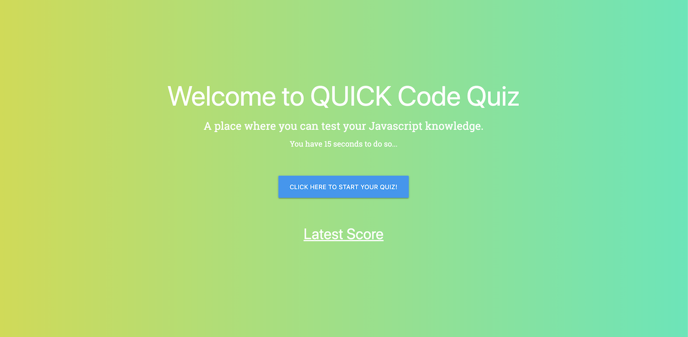

# Code Quiz

## Description

This application is password generator built with:

-   HTML5
-   Materialize-css
-   Javascript

User can take a Javascript related short quiz for 15 seconds. Once time is up or all answers are chosen, user is taken to the score page.

With this app users can:

-   User can take a Javascript related short quiz for 15 seconds.
-   Save their scores to high score page database.
-   Check out the High Score page and if they make it to the top 5 list.

## Prerequisites

-   Web browser like Google Chrome or Safari

## Installation

No installation required. This app works automatically when opened in a browser.

© 2019 Pablo Motta
